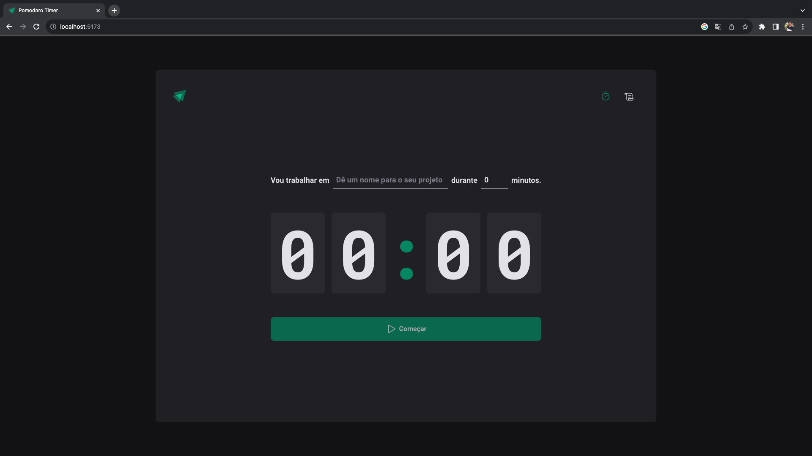
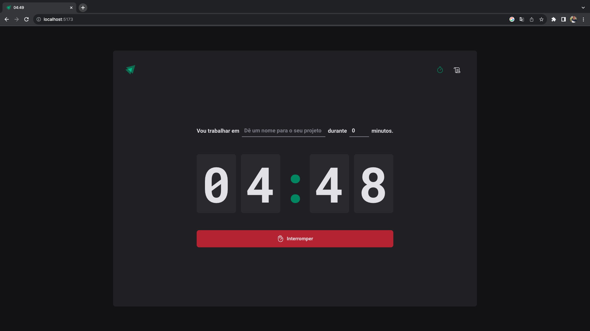
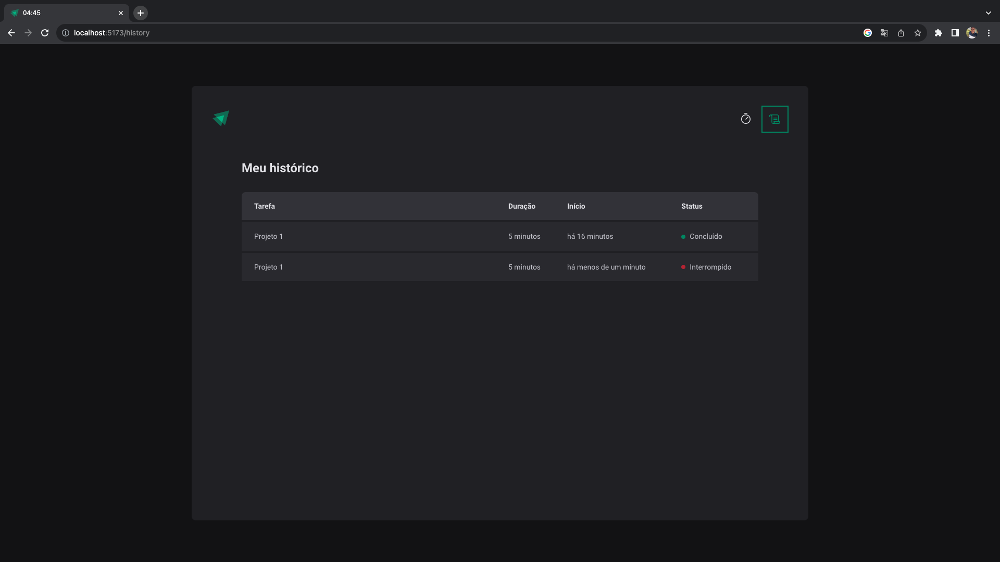

<h1 align="center">
    
     Pomodoro Timer
</h1>

## Descrição:

Aplicação front-end desenvolvida durante a especialização Ignite. Ela tem por objetivo implementar a técnica de pomodoro, que de forma bastante resumida, consiste em administrar o tempo empregado nas tarafes de forma que em um intervalo de tempo emprega-se concentração máxima, seguido de períodos de relaxamento, visando o aumento da produtividade.

Nessa aplicação além do temporizador foi desenvolvido uma página de histórico para validar a empregabilidade da técnica. Por se tratar de uma aplicação que funciona totalmente no lado do cliente, as informações são armazenadas no localStorage, sendo recuperadas de forma natural durante uma atualização de página.

A troca de informações entre as páginas ocorre de forma centralizada por contextos, e executada por reducers com o auxílio da biblioteca immer, que provém acesso direto e implementa a imutabilidade.

## Screenshots

    

    

    

